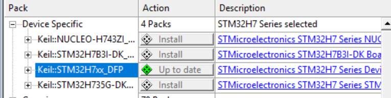
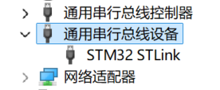
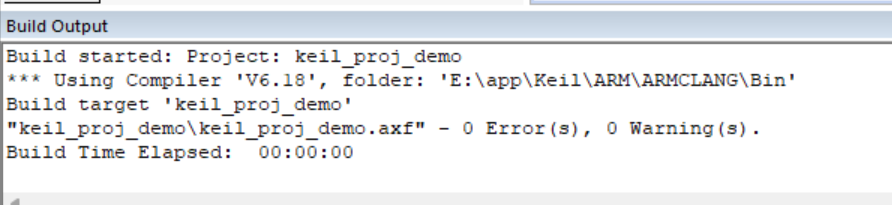
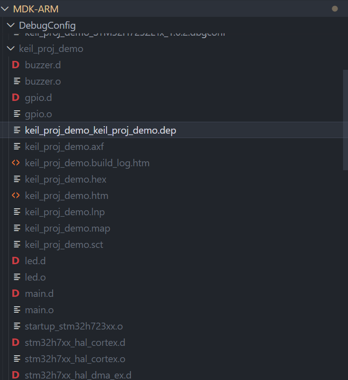
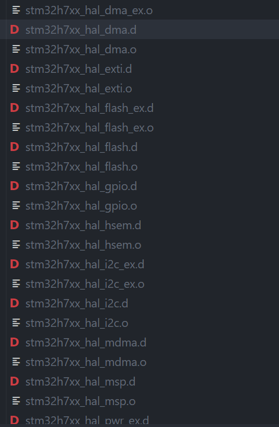
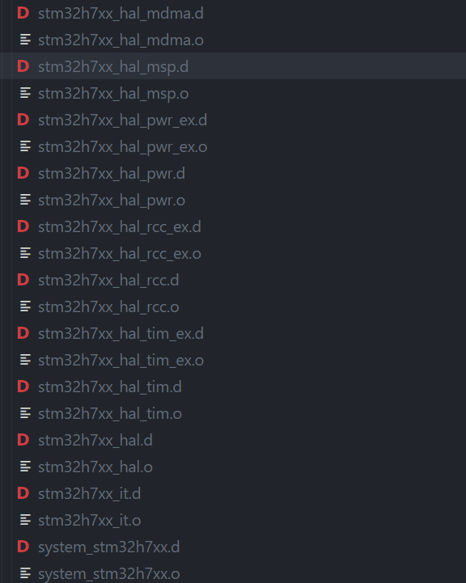

# 编译烧录与工具链

## 作业1：确认工具链

1. 
  - STM32H7器件支持包已安装
   
  - ST-Link驱动已安装
    

3. 
4. 流水灯现象，LED灯从LED_1闪烁至LED_4，每个周期的第四个灯闪烁完后蜂鸣器发出响声

## 作业2：认识编译产物

- .s是汇编文件
- .o是机器码文件
- .axf是链接后的可执行文件
- .hex是可通过STLINK烧录器烧录到芯片的文件

### F7完成了哪几步（保留关键部分）
  1. 预处理
     1. 头文件展开
     2. 宏定义替换
     3. 处理条件编译 #ifdef /#ifndef /#endif
     4. 删除注释
  2. 编译 
     1. 将预处理后的代码翻译为汇编语言.s文件
  3. 汇编
     1. 将编译生成的汇编语言.s文件通过汇编器翻译为机器码.o文件
  4. 链接
     1. 全部.o目标文件+启动文件的.o+库文件通过链接器链接为单个可执行文件.axf
  5. 后处理
     1. Keil自带工具fromelf把.axf文件转化为.hex文件，用于烧录工具下载到芯片Flash

### F8把什么文件写进芯片
  - .hex文件
### 为什么改完代码必须重新编译再下载
  - 重新编译的目的是为了根据新的源代码重新生成新的.hex文件以供STLINK烧录器烧录

## 作业3&5：配置工程
### 配置工程的完整步骤
1. 工具链检查
   1. 设备管理器看使用的调试器驱动是否安装
   2. Pack Installer内看芯片包是否安装
   3. 通过编译和烧录检查前两步是否有误和检查工程源文件和头文件是否缺失
2. 若工程源文件和头文件缺失
   1. 新建工程内的自定义Group默认命名为User，若该项缺失则自行创建
   2. 在User Group内新增c源文件
   3. 在魔法棒内的C/C++栏加入c源文件对应的头文件目录

### 常见报错
[报错日志](配置工程报错日志.md)

