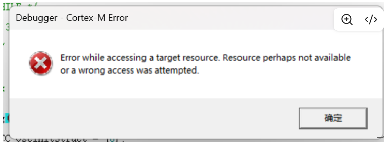
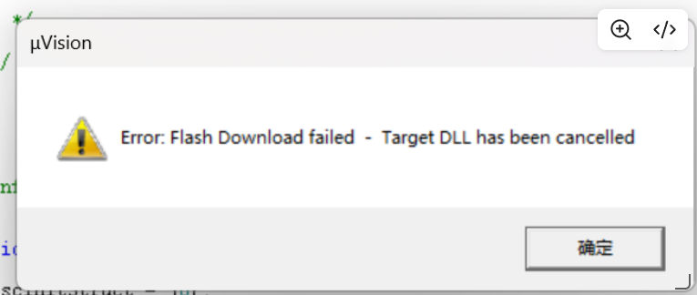
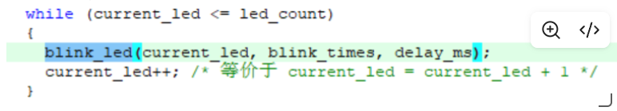
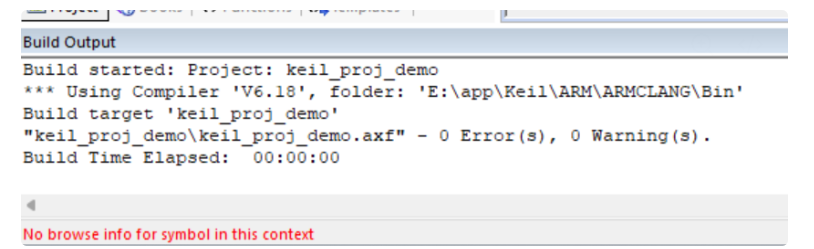
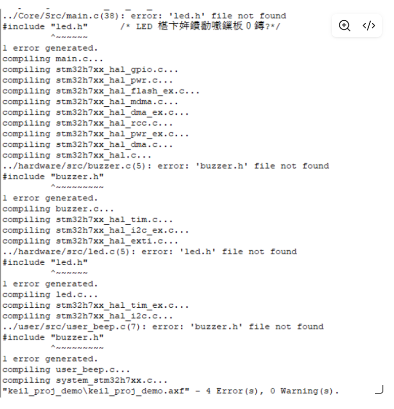
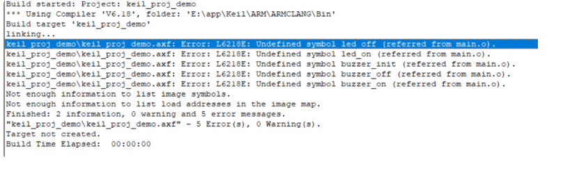

# 1.
## 问题背景
芯片：H7
debugger：ST-LINK

编译并烧录STM32cubemx生成的代码框架时，遇到如图所示的两个报错

## 解决方法
按动复位键，重新烧录

# 2.

## 问题背景
在main.c中尝试跳转到blink_led（）函数的定义时出现了“No browse info for symbol in this context”的报错

## 解决方法
将工程路径切换至无中文字符的目录下

# 3.头文件缺失

## 解决方法
在魔法棒中的C/C++中新增头文件夹路径

# 4.源代码文件缺失

## 解决方法
在.c文件所在Group中加入所需的.c文件

